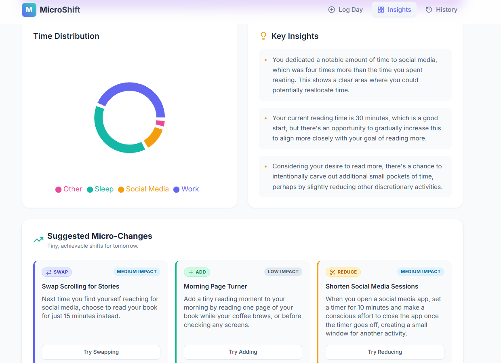
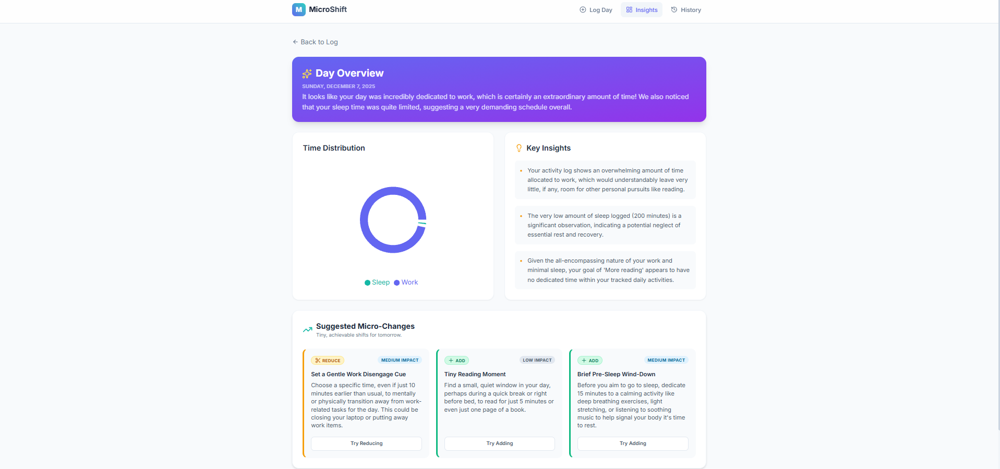
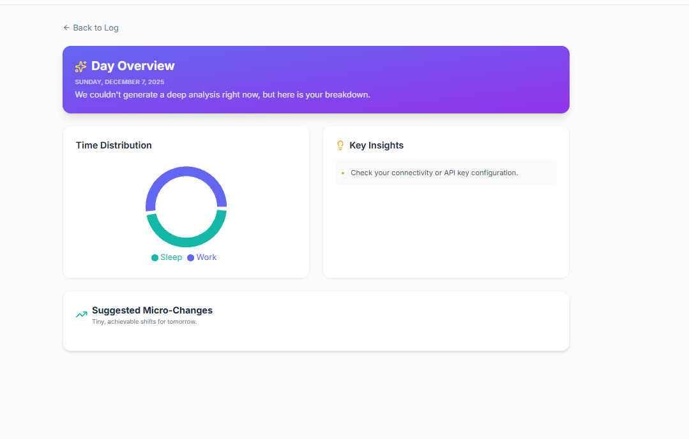

# TestPlan.md — Habit & Time-Use Assistant (MVP)

## Test Case 1: Basic single-day analysis (happy path)
- Input:
  - Activities: Work 480m, Sleep 420m, Social Media 120m, Reading 30m
  - Goals: ["more reading"]
- Steps:
  1. Open app.
  2. Enter activities and goal.
  3. Click Analyze.
- Expected:
  - HTTP 200 from /api/analyze.
  - Frontend shows a pie chart approximating the input distribution.
  - At least 2 insights shown, one referencing social media over-investment or reading under-investment.
  - At least 1 micro-change recommending shifting <= 60 minutes to reading.
- Actual: 
- POSITIVE

## Test Case 2: Sum validation (invalid total minutes)
- Input:
  - Activities adding to > 24 hours (e.g., 1500 minutes).
- Steps:
  1. Enter activities with unrealistic total > 1440 minutes.
  2. Click Analyze.
- Expected:
  - Frontend prevents submission and shows validation error: "Total time exceeds 24 hours — please check entries."
  - No call to /api/analyze.
- Actual: 
- NEGATIVE

## Test Case 3: Gemini failure fallback
- Input:
  - Normal day log, but Gemini API responds with error or times out.
- Steps:
  1. Simulate Gemini timeout (backend).
  2. Click Analyze.
- Expected:
  - Analyze complete and it shows "We Couldnt generate a depp analysis right now, but here is your breakdown." And we see a pie chart of the time distribution
- Actual: 
- POSITIVE