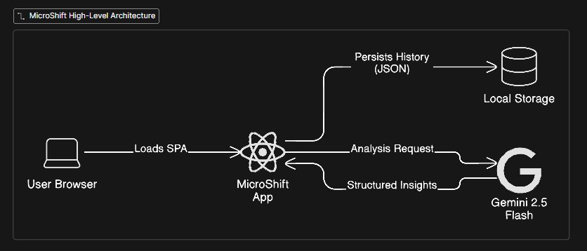

# Use Cases & Design

---

## Use Case 1 — Log and analyze a single day

**Actor:** User  
**Goal:** Record a day’s activities and see a summary with insights and suggested small adjustments.  
**Preconditions:** User has the app open; no login required.  
**Trigger:** User finishes logging all activities for the day and adds personal goals.  

**Steps:**  
1. User adds activities and durations (e.g., work, study, sleep, social media, exercise).  
2. User optionally adds personal goal(s) like “more reading” or “less social media.”  
3. User clicks **Analyze**.  
4. Frontend sends the day’s activities, goals, and user configuration to the backend.  
5. Backend generates a summary including:  
   - Time distribution (pie/bar chart)  
   - Key insights (e.g., “Social media dominates your free time”)  
   - Micro-adjustment suggestions (e.g., shift 20 minutes from social media to reading).  
6. Frontend displays the summary and insights to the user.  

**Expected outcome:**  
User immediately sees how their day was spent and gets actionable suggestions to improve goal alignment.

---

## Use Case 2 — Track historical activity

**Actor:** User  
**Goal:** Access and review previous day logs to understand trends or patterns.  
**Preconditions:** User has logged at least one day.  
**Trigger:** User opens the **History** section of the app.  

**Steps:**  
1. User navigates to the **History** page.  
2. Frontend retrieves saved day logs.  
3. User clicks on a specific day.  
4. Frontend shows the breakdown of activities, durations, and any previous insights or micro-adjustments suggested.  

**Expected outcome:**  
User can easily review past activity, see patterns, and understand which activities occupy most of their time.

---

## Use Case 3 — Compare multiple days (MVP limitation)

**Actor:** User  
**Goal:** Review multiple past days to spot differences in daily routines.  
**Preconditions:** User has logged multiple days.  
**Trigger:** User opens the **History** section of the app.  

**Steps:**  
1. User navigates to the **History** page.  
2. Frontend displays a list of past days.  
3. User selects a day to view its detailed breakdown (activities, durations, insights, micro-changes).  
4. User can repeat selection for other days to manually compare patterns.  

**Expected outcome:**  
User can review individual past days and manually observe differences between days, but automated multi-day trends are not yet supported.

---

